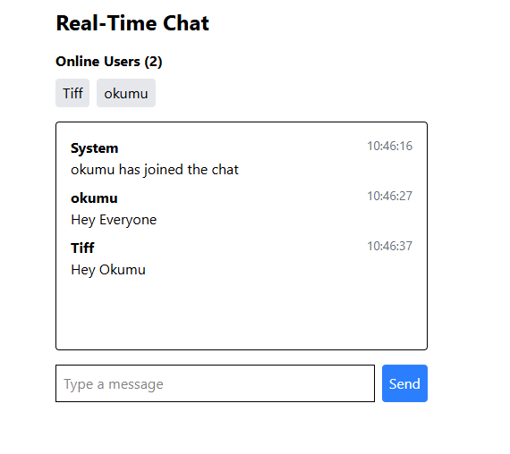
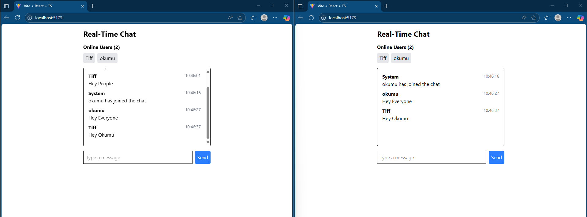

# 🚀 Real-Time Chat Application with Socket.io

A modern real-time chat app demonstrating bidirectional communication between clients and server using **Socket.io**.

---

## ✨ Features

- **User authentication** (username-based)
- **Global chat room** for all users
- **Message display** with sender's name & timestamp
- **Typing indicators**
- **Online/offline status** for users
- **Real-time notifications**
- **Responsive design**

---

## 🛠️ Technologies Used

<p align="left">
  
  
  
  
  
  
  
</p>

---

## ⚡ Setup Instructions

### Prerequisites

- [Node.js v18+](https://nodejs.org/)
- [pnpm](https://pnpm.io/)

### Installation

```bash
# Clone the repository
$ git clone https://github.com/ValrieO/real-time-comm.git

# Install dependencies for server
$ cd server
$ pnpm install

# Install dependencies for client
$ cd ../client
$ pnpm install
```

### Running the Application

```bash
# Start the server
$ cd server
$ pnpm run dev

# Start the client
$ cd ../client
$ pnpm run dev
```

Opened browser and navigated to [http://localhost:5173](http://localhost:5173)

---

## 🖼️ Screenshots

<div align="center">
  
  
</div>

---

## 🚀 Deployment

### Server Deployment
- [Render](https://render.com/)


### Client Deployment

You can deploy the client to:
- [Vercel](https://vercel.com/)

---

## 🌱 Future Enhancements

- Private messaging between users
- Multiple chat rooms
- File/image sharing
- Read receipts
- Message reactions

````markdown